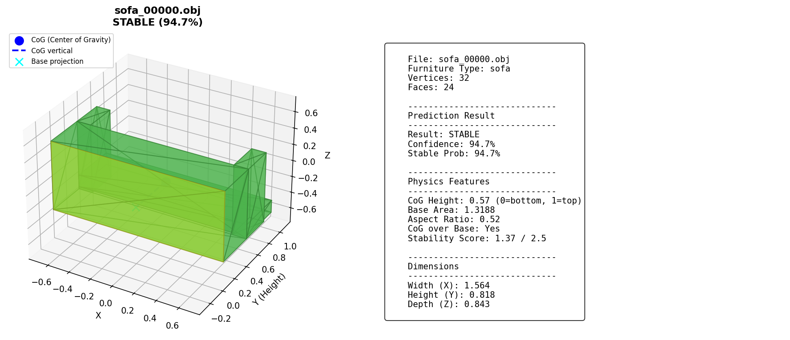
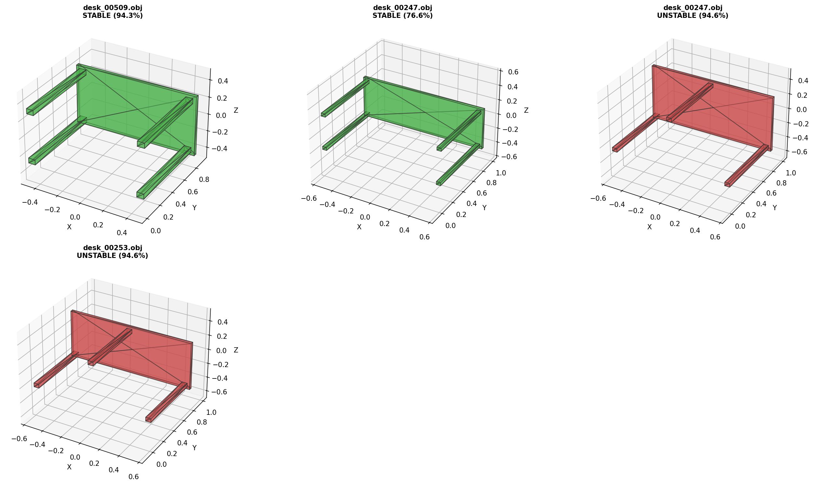

# Furniture Stability AI

3D家具モデルの安定性を予測する深層学習システム

## Overview

点群データから家具の物理的安定性（転倒しにくさ）を判定するAIモデルです。

- **精度**: 97.9%
- **対応家具**: 8種類 (chair, table, shelf, cabinet, desk, sofa, stool, bench)
- **学習データ**: 11,396サンプル

## Features

- PointNet + Local Features アーキテクチャ
- Test-Time Augmentation (TTA) による高精度推論
- 物理特徴（重心位置、底面積、アスペクト比）の解析
- 3D可視化ツール

## Installation

```bash
# Clone
git clone https://github.com/tsuyoshi-sk/furniture-stability-ai.git
cd furniture-stability-ai

# Dependencies
pip install torch numpy matplotlib
```

## Usage

### Inference (推論)

```bash
# Single file
python3 inference.py model.obj

# Multiple files
python3 inference.py file1.obj file2.obj file3.obj

# Directory
python3 inference.py ./models/

# Evaluate all types
python3 inference.py --evaluate

# Save to JSON
python3 inference.py model.obj -o result.json
```

**Output example:**
```
予測結果:
  ファイル: chair_001.obj
  家具タイプ: chair
  予測: stable (94.7% stable)
  信頼度: 94.7%
  物理スコア: 1.37/2.5
```

### Visualization (可視化)

```bash
# Single file with details
python3 visualize.py model.obj

# Compare multiple files
python3 visualize.py stable.obj unstable.obj --compare

# Save image
python3 visualize.py model.obj --save output.png

# Generate gallery for all furniture types
python3 visualize.py --gallery
```

### Training (学習)

```bash
# Generate dataset
python3 generate_furniture.py --num 500

# Train model
python3 train_augmented.py
```

## Project Structure

```
furniture-stability-ai/
├── inference.py          # Inference script
├── visualize.py          # 3D visualization tool
├── train_augmented.py    # Training with augmentation
├── generate_furniture.py # Dataset generation
├── models_augmented/     # Trained models
│   └── local_augmented_best.pth
├── dataset/              # Training data
│   ├── stable/           # Stable furniture OBJs
│   └── unstable/         # Unstable furniture OBJs
└── visualizations/       # Generated gallery images
```

## Model Performance

| Furniture Type | Stable | Unstable | Total |
|----------------|--------|----------|-------|
| chair          | 86.0%  | 96.0%    | 91.0% |
| table          | 92.0%  | 92.0%    | 92.0% |
| shelf          | 100%   | 100%     | 100%  |
| cabinet        | 100%   | 100%     | 100%  |
| desk           | 100%   | 100%     | 100%  |
| sofa           | 100%   | 100%     | 100%  |
| stool          | 100%   | 100%     | 100%  |
| bench          | 100%   | 100%     | 100%  |
| **Overall**    |        |          | **97.9%** |

## Visualization Examples

### Single File View


### Gallery View


## Technical Details

### Architecture
- **Encoder**: PointNet with Local Features (512-dim)
- **Classifier**: 3-layer MLP with BatchNorm and Dropout
- **Input**: 1024 sampled points from OBJ mesh

### Training
- Data Augmentation: Rotation, Scale, Noise, Dropout, Jitter, Shift, Mirror
- Mixup: alpha=0.2
- Label Smoothing: 0.1
- Optimizer: AdamW with Cosine Annealing
- Early Stopping: patience=30

### Physics Features
- **CoG Height**: Center of gravity relative height (0=bottom, 1=top)
- **Base Area**: Support polygon area
- **Aspect Ratio**: Height / Base width
- **CoG over Base**: Whether CoG projects within base

## License

MIT License

## Author

Created with Claude Code
